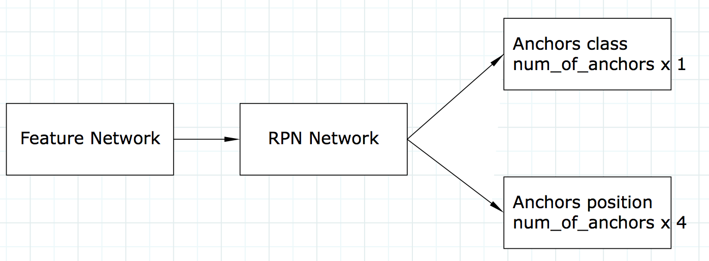

### <a name="dl-object-detection">目标识别object detection </a>
#### rcnn pseudo code
```python
ROIs = Selective_Search(image)
for ROI in ROIs
    roi_feature = extract_feature(ROI)
    class_scores, box = detector(patch)
```
#### faster rcnn pseudo code  
https://medium.com/@jonathan_hui/understanding-region-based-fully-convolutional-networks-r-fcn-for-object-detection-828316f07c99
```python
# 提取feature
feature_maps = extract_feature(image)
# 生成可选区域
ROIs = region_proposal(feature_maps)
# 对可选区域的每一个
for ROI in ROIs
    # 在特征图上对该区域pooling出固定大小的patch
    patch = roi_pooling(feature_maps, ROI)
    # 对patch进行检测获得坐标及分类得分
    class_scores, box = detector(patch)
    # 对分类得分做softmax，获得最终分类
    class_probabilities = softmax(class_scores)
```  

### <a name="dl-tensorflow-stanford"> 斯坦福tensorflow课程 </a>
https://web.stanford.edu/class/cs20si/syllabus.html

### <a name="dl-keras-learning">tensorflow keras API使用简介</a>
#### 查看tensorflow, keras版本
import tensorflow as tf  
from tensorflow.keras import layers  
print(tf.VERSION)  
print(tf.keras.__version__)  

#### 构造一个简单的模型
model = tf.keras.Sequential([  
  #添加一个dense layer（全连接）, input=32,output=64  
  layers.Dense(64, activation='relu', input_shape=(32,)),  
  #添加另一个 dense layer  
  layers.Dense(64, activation='relu'),  
  #添加softmax层，输出数目为10  
  layers.Dense(10, activation='softmax')  
  ])  

#### 编译model  
#指定训练方法optimizer，loss函数，训练监测metrics  
model.compile(optimizer=tf.train.AdamOptimizer(0.001),  
              loss='categorical_crossentropy',  
              metrics=['accuracy'])  


#### 使用numpy创建随机训练数据  
import numpy as np    
data = np.random.random((1000, 32))  
labels = np.random.random((1000, 10))  

#### 对训练数据进行训练，指定迭代次数epochs和batch size   
model.fit(data, labels, epochs=10, batch_size=32)


#### 增加验证数据，在训练的同时监测模型性能
val_data = np.random.random((100, 32))  
val_labels = np.random.random((100, 10))  

model.fit(data, labels, epochs=10, batch_size=32,  
          validation_data=(val_data, val_labels))    
  

#### 训练时，通过dataset来加载训练数据  

dataset = tf.data.Dataset.from_tensor_slices((data, labels))    
dataset = dataset.batch(32)  
dataset = dataset.repeat()  

model.fit(dataset, epochs=10, steps_per_epoch=30)  


### <a name="it-nvidia-driver">nvidia GPU驱动</a>
sudo apt-get remove –purge nvidia*  
sudo add-apt-repository ppa:graphics-drivers/ppa  
sudo apt-get update  
sudo apt-get install nvidia-390  

nvidia-smi

### <a name="it-vnc">vncserver</a>
vncserver启动时修改分辨率 颜色深度  
vncserver  -geometry 1366x768 -depth 24 &  
vncserver重置密码  
vncpasswd  


### <a name="dl-facenet"> facenet 人脸识别
https://blog.csdn.net/xingwei_09/article/details/79161931  
https://github.com/davidsandberg/facenet  
https://github.com/deepinsight/insightface  
人脸识别、人脸检测、人脸对齐相关论文  
https://www.jianshu.com/p/27aae9ec045d  
 

### <a name="dl-frcnn"> 理解faster rcnn

### <a name="dl-np-transpose"> 如何理解多维矩阵的转置
1. 长度为96的数字序列  
arr = np.arange(96)  

2. 利用上一步的序列构造大小为4x4，3通道的2张二维图来演示4维矩阵的转置    
dummy_images = arr.reshape(2,4,4,3)   
第一个维度：图片序号  
第二个维度：图片的行  
第三个维度：图片的列  
第四个维度：图片的通道  

3. 将通道数转换到第二个维度，行和列变为第三维度  
transpose_images = dummy_images.transpose(0,3,1,2)  
transpose_images.shape # (2,3,4,4)   
也就是说如果我们要取第一张图的第一个通道数据可以有以下两个途径：  
* dummy_images[0,:,:,0]  
* transpose_images[0,0,:,:]  


### <a name="dl-tracker"> 实时视频目标跟踪
http://www.robots.ox.ac.uk/~luca/siamese-fc.html   
https://github.com/torrvision/siamfc-tf   
http://davheld.github.io/GOTURN/GOTURN.pdf   
 
### <a name="it-parted-big-disk"> linux 2T以上硬盘分区 
parted /dev/sdb mklabel gpt  
parted /dev/sdb mkpart primary 0 4000000 创建4T的分区  
mkfs -t ext4 /dev/sdb1  
mount /dev/sdb1 /mnt/sdb   


### <a name="code-build-python-to-exe"> 编译python程序到可执行文件
https://github.com/Nuitka/Nuitka  
https://zhuanlan.zhihu.com/p/31721250  
https://blog.526net.com/?p=3166  


### <a name="it-nfs">ubuntu16.04 安装nfs</a>
服务器端  
sudo apt install nfs-kernel-server  
 编辑/etc/exports 文件，export /logs目录  
/logs *(rw,sync,no_subtree_check,no_root_squash)  
重启nfs服务使配置生效    
sudo service nfs-kernel-server restart  
客户端   
sudo apt install nfs-common  
编辑/etc/fstab 自动挂载服务器目录到本地目录  
192.168.1.234:/logs      /mnt/logs      nfs     defaults         0      2  
sudo mount -a

### <a name="dl-caffelog">关闭cafffe日志输出</a>
export GLOG_minloglevel=1  

### <a name="it-dnsserver">ubuntun linux 域名服务器配置</a>
vim /etc/resolvconf/resolv.conf.d/base  
nameserver 8.8.8.8   
sudo resolvconf -u  

### <a name="it-routeconf">ubuntu linux 路由表配置</a>
所有发往192.168.*.*通过192.168.11.1  
sudo route add -net 192.168.0.0 netmask 255.255.0.0 gw 192.168.11.1  

路由配置加到 /etc/rc.local 避免重启后丢失  
route add -net 172.16.0.0 netmask 255.255.0.0 gw 172.16.0.1  

### <a name="it-ignorenetwork">ubuntu跳过开机网络检测</a>
进入系统后修改文件/etc/systemd/system/network-online.target.wants/networking.service  
命令：sudo vim /etc/systemd/system/network-online.target.wants/networking.service  
将里面的TimeoutStartSec=5min 修改为TimeoutStartSec=2sec  

### <a name="it-ramfs">linux 建立100M的ramfs</a>
sudo mount -t ramfs none ramfs -o maxsize=100000


### <a name="dl-mscoco2017">MS coco 2017 数据集</a>
http://images.cocodataset.org/zips/train2017.zip  
http://images.cocodataset.org/annotations/annotations_trainval2017.zip

http://images.cocodataset.org/zips/val2017.zip 
http://images.cocodataset.org/annotations/stuff_annotations_trainval2017.zip

http://images.cocodataset.org/zips/test2017.zip 
http://images.cocodataset.org/annotations/image_info_test2017.zip 
这些就是全部的microsoft coco数据集2017的链接了。

在linux上可以使用axel多线程工具来下载

### <a name="code-excel-vba-mysql">Excel使用VBA与访问MySql数据</a>
* 安装mysql odbc 32位驱动 https://dev.mysql.com/downloads/connector/odbc/
* 打开Excel按下Alt+F11打开VBE
* 在VBE菜单栏选择“工具”－“引用”，在弹出的引用窗口中，找到"Microsoft ActiveX Data Objects 6.1 Library"和"Microsoft ActiveX Data Objects Recordset 6.0 Library"，把前面的框勾选上，点击确定即可
```vb
    Dim conn As ADODB.Connection
    Dim rs As ADODB.Recordset
    Set conn = New ADODB.Connection
    Set rs = New ADODB.Recordset
    ' 一定要安装mysql odbc 32位驱动 https://dev.mysql.com/downloads/connector/odbc/
    conn.ConnectionString = "Driver={MySQL ODBC 8.0 Unicode Driver};Server=192.168.1.252;DB=huanbao;UID=huanbao;PWD=huanbao;OPTION=3;"
    conn.Open
    rs.Open "select * from `HB_BJJL`", conn
    'copy数据记录到excel表格
    Range("A2").CopyFromRecordset rs
    rs.Close: Set rs = Nothing
    conn.Close: Set conn = Nothing
```

### <a name="it-nginx-ERR_INCOMPLETE_CHUNKED_ENCODING">net::ERR_INCOMPLETE_CHUNKED_ENCODING 错误</a>

net::ERR_INCOMPLETE_CHUNKED_ENCODING 错误，但是本地调试没有这个错误，最终发现是服务器的Nginx 配置上有问题，查看error.log 显示的是Upstream prematurely closed connection while reading upstream...错误，翻墙谷歌最终在nginx.conf 的http模块内加入


proxy_request_buffering off;  
proxy_buffering off;  

### mmdetection yolov3 to darknet
```python
from mmdet.apis import init_detector, inference_detector
from mmdet.apis import inference_detector, init_detector, show_result_pyplot
import mmcv
import torch
import mmdet
import numpy as np

config_file = 'configs/faster_rcnn/faster_rcnn_r50_fpn_1x_coco.py'
config_file = '/mnt/sdb/trains/cup/cup.py'
# download the checkpoint from model zoo and put it in `checkpoints/`
# url: http://download.openmmlab.com/mmdetection/v2.0/faster_rcnn/faster_rcnn_r50_fpn_1x_coco/faster_rcnn_r50_fpn_1x_coco_20200130-047c8118.pth
checkpoint_file = 'checkpoints/faster_rcnn_r50_fpn_1x_coco_20200130-047c8118.pth'
checkpoint_file = '/mnt/sdb/trains/cup/mmdir/epoch_98.pth'
device = 'cuda:0'
# init a detector
model = init_detector(config_file, checkpoint_file, device=device)
# print(dir(model))
# print(model.backbone().layers())
# print(dir(model.neck))
# print(type(model.neck))


'''
    backbone

    conv    512  1 x 1 / 1    22 x  22 x1024   ->    22 x  22 x 512 0.508 BF
    76 conv   1024  3 x 3 / 1    22 x  22 x 512   ->    22 x  22 x1024 4.568 BF
    77 conv    512  1 x 1 / 1    22 x  22 x1024   ->    22 x  22 x 512 0.508 BF
    78 conv   1024  3 x 3 / 1    22 x  22 x 512   ->    22 x  22 x1024 4.568 BF
    79 conv    512  1 x 1 / 1    22 x  22 x1024   ->    22 x  22 x 512 0.508 BF
    80 conv   1024  3 x 3 / 1    22 x  22 x 512   ->    22 x  22 x1024 4.568 BF
    81 conv     18  1 x 1 / 1    22 x  22 x1024   ->    22 x  22 x  18 0.018 BF
    82 make yolo layer:batch=1,w=22,h=22,n=3,total=9,classes=1,max_boxes=90
    yolo
    83 route  79
    84 conv    256  1 x 1 / 1    22 x  22 x 512   ->    22 x  22 x 256 0.127 BF
    85 upsample            2x    22 x  22 x 256   ->    44 x  44 x 256
    86 route  85 61
    87 conv    256  1 x 1 / 1    44 x  44 x 768   ->    44 x  44 x 256 0.761 BF
    88 conv    512  3 x 3 / 1    44 x  44 x 256   ->    44 x  44 x 512 4.568 BF
    89 conv    256  1 x 1 / 1    44 x  44 x 512   ->    44 x  44 x 256 0.508 BF
    90 conv    512  3 x 3 / 1    44 x  44 x 256   ->    44 x  44 x 512 4.568 BF
    91 conv    256  1 x 1 / 1    44 x  44 x 512   ->    44 x  44 x 256 0.508 BF
    92 conv    512  3 x 3 / 1    44 x  44 x 256   ->    44 x  44 x 512 4.568 BF
    93 conv     18  1 x 1 / 1    44 x  44 x 512   ->    44 x  44 x  18 0.036 BF
    94 make yolo layer:batch=1,w=44,h=44,n=3,total=9,classes=1,max_boxes=90
    yolo
    95 route  91
    96 conv    128  1 x 1 / 1    44 x  44 x 256   ->    44 x  44 x 128 0.127 BF
    97 upsample            2x    44 x  44 x 128   ->    88 x  88 x 128
    98 route  97 36
    99 conv    128  1 x 1 / 1    88 x  88 x 384   ->    88 x  88 x 128 0.761 BF
    100 conv    256  3 x 3 / 1    88 x  88 x 128   ->    88 x  88 x 256 4.568 BF
    101 conv    128  1 x 1 / 1    88 x  88 x 256   ->    88 x  88 x 128 0.508 BF
    102 conv    256  3 x 3 / 1    88 x  88 x 128   ->    88 x  88 x 256 4.568 BF
    103 conv    128  1 x 1 / 1    88 x  88 x 256   ->    88 x  88 x 128 0.508 BF
    104 conv    256  3 x 3 / 1    88 x  88 x 128   ->    88 x  88 x 256 4.568 BF
    105 conv     18  1 x 1 / 1    88 x  88 x 256   ->    88 x  88 x  18 0.071 BF
'''


def dumpConvModule(module,f):
    module.bn.bias.data.cpu().numpy().tofile(f)
    module.bn.weight.data.cpu().numpy().tofile(f)
    module.bn.running_mean.data.cpu().numpy().tofile(f)
    module.bn.running_var.data.cpu().numpy().tofile(f)
    module.conv.weight.data.cpu().numpy().tofile(f)
print(model)
def dumpModel(m,i,f):
    j = 1
    if type(m) == mmcv.cnn.bricks.conv_module.ConvModule:
        # print(type(module))
        dumpConvModule(m,f)
    elif type(m) == torch.nn.modules.conv.Conv2d:
        m.bias.data.cpu().numpy().tofile(f)
        m.weight.data.cpu().numpy().tofile(f)
    elif type(m) == torch.nn.modules.batchnorm.BatchNorm2d:
        m.bias.data.cpu().numpy().tofile(f)
        m.weight.data.cpu().numpy().tofile(f)
        m.running_mean.data.cpu().numpy().tofile(f)
        m.running_var.data.cpu().numpy().tofile(f)
    else:
        for c in m.children():
            ids = "{}-{}".format(i,j)
            print("{}:".format(ids),type(c))
            dumpModel(c,ids,f)
            j+=1


def convertToDarknet(model,path):
    with open(path, 'wb') as f:
        version = np.array([0, 2, 5], dtype=np.int32)  # (int32) version info: major, minor, revision
        seen = np.array([0], dtype=np.int64)  # (int64) number of images seen during training
        version.tofile(f)  # (int32) version info: major, minor, revision
        seen.tofile(f)  # (int64) number of images seen during training
        dumpModel(model.backbone,"",f)
        
        dumpModel(model.neck.detect1,"",f)
        
        dumpModel(model.bbox_head.convs_bridge[0],"",f)
        dumpModel(model.bbox_head.convs_pred[0],"",f)

        dumpModel(model.neck.conv1,"",f)
        dumpModel(model.neck.detect2,"",f)
        dumpModel(model.bbox_head.convs_bridge[1],"",f)
        dumpModel(model.bbox_head.convs_pred[1],"",f)
        
        dumpModel(model.neck.conv2,"",f)
        dumpModel(model.neck.detect3,"",f)
        dumpModel(model.bbox_head.convs_bridge[2],"",f)
        dumpModel(model.bbox_head.convs_pred[2],"",f)

        
        

path = "cupv3.weights"
convertToDarknet(model,path)


# inference the demo image
# imfile = "/mnt/4T/tmp/cup/1612495491441.jpg"
# result = inference_detector(model, imfile)
# show_result_pyplot(model, imfile, result, score_thr=.3)

```

### [imdb和roidb的说明](./rcnn-roidb)

### [2018-10-17 古建筑笔记](./gujian-note)
